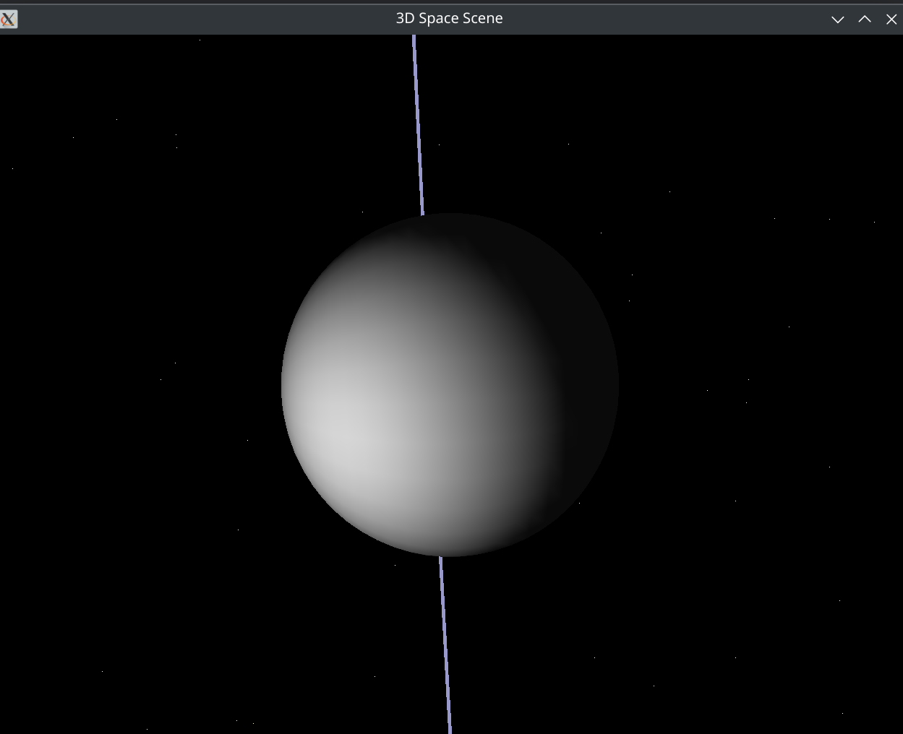

# 3DGalaxy - A Cosmic Space Adventure

 *Example screenshot would go here*

## Overview

3DGalaxy is an optimized 3D space exploration game inspired by the gravity-defying mechanics of Mario Galaxy, built using C++ and OpenGL for Linux systems. Experience a mesmerizing cosmic environment with:

- A dynamic starfield with depth-based movement
- Interactive 3D celestial objects
- Mouse-controlled camera rotation
- Smooth orbital mechanics

## Features

- **Immersive 3D Environment**: Explore a procedurally generated starfield with realistic depth perception
- **Interactive Controls**: Rotate your view by clicking and dragging with the mouse
- **Optimized Rendering**: Efficient OpenGL implementation for smooth performance
- **Celestial Objects**: Navigate around a central planetary object with visible rings

## System Requirements

- Linux operating system
- OpenGL 2.0+ compatible graphics card
- GLUT (OpenGL Utility Toolkit) libraries
- C++ compiler (g++ recommended)

## Installation

1. Ensure you have the required dependencies:
   ```bash
   sudo apt-get install freeglut3 freeglut3-dev g++
   ```

2. Clone the repository:
   ```bash
   git clone https://github.com/yourusername/3DGalaxy.git
   cd 3DGalaxy
   ```

3. Compile the project:
   ```bash
   g++ main.cpp -o 3DGalaxy -lGL -lGLU -lglut
   ```

4. Run the game:
   ```bash
   ./3DGalaxy
   ```

## Controls

- **Left Mouse Button + Drag**: Rotate the camera view
- The view automatically rotates slowly for a screensaver-like effect

## Technical Details

The game utilizes:
- OpenGL for 3D rendering
- GLUT for window management and input handling
- Procedural generation for star placement
- Spherical coordinate mathematics for celestial object placement
- Depth testing for proper 3D rendering

## Future Development

Planned enhancements include:
- [ ] Player-controlled spacecraft
- [ ] Gravity-based gameplay mechanics
- [ ] Additional celestial objects and obstacles
- [ ] Sound effects and background music
- [ ] Scoring system and objectives

## License

This project is licensed under the MIT License - see the [LICENSE](LICENSE) file for details.

## Acknowledgments

- Inspired by the gravity mechanics of Super Mario Galaxy
- Built using OpenGL and GLUT libraries
- Special thanks to the open source community for graphics programming resources
